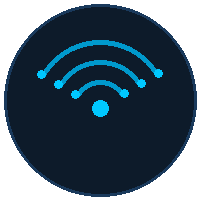

# UniFi Integration

<p align="center"></p>

A GLPI 11 plugin that synchronizes your **UniFi Site Manager** data — sites, hosts (UDM, UCG…) and devices (APs, switches, routers) — directly into GLPI assets.

## Features

- Connects to the official UniFi Cloud API (`api.ui.com`) using a static `X-API-KEY`
- Synchronizes **UniFi sites** → GLPI **Locations**
- Synchronizes **hosts / consoles** (UDM SE, UCG Ultra…) → GLPI **NetworkEquipment**
- Synchronizes **devices** (APs, switches, routers) → GLPI **NetworkEquipment**
- **ECharts dashboard** with device-status pie chart and firmware-status bar chart
- Device table with inline search, status badges, and firmware badges
- Manual **Sync now** button with live spinner
- Configurable **cron task** (5 min → 1 hour)
- Sync log with last 10 runs
- Fully localized (es\_MX · en\_US · en\_GB · fr\_FR · de\_DE)

## Requirements

- GLPI 11.0 or higher
- PHP 8.1+ with the **cURL** extension enabled
- Network access from your GLPI server to `https://api.ui.com`

## Installation

### Manual

1. Download the latest release `.zip`
2. Unzip into your GLPI plugins directory:
   ```
   /var/www/glpi/plugins/unifiintegration/
   ```
3. Go to **Setup → Plugins**
4. Click **Install** next to UniFi Integration, then **Enable**

## Configuration

1. Navigate to **Plugins → UniFi Integration → Settings**
2. Obtain an API Key:
   - Sign in at [unifi.ui.com](https://unifi.ui.com)
   - Go to **API** in the left navigation bar
   - Click **Create API Key** — copy it immediately (shown only once)
3. Paste the key into the **API Key** field
4. Click **Test connection** to verify
5. Select which items to synchronize and set the cron interval
6. Click **Save**

## Locales

| Language | Status |
|---|---|
| Español (México) | Full |
| Français (France) | Full |
| Deutsch | Full |
| English (US) | Base |
| English (UK) | Base |

## Changelog

See [CHANGELOG.md](CHANGELOG.md).

## License

GPL v3+. See [LICENSE](LICENSE).

## Author

Edwin Elias Alvarez
